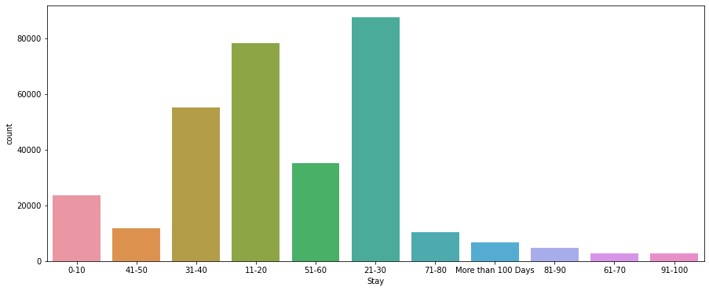

```python
import numpy as np
import pandas as pd
import matplotlib.pyplot as plt
import seaborn as sns
%matplotlib inline
```


```python
df = pd.read_csv("train_data.csv")
```


```python
df.head()
```


<div>
<style scoped>
    .dataframe tbody tr th:only-of-type {
        vertical-align: middle;
    }

    .dataframe tbody tr th {
        vertical-align: top;
    }

    .dataframe thead th {
        text-align: right;
    }
</style>
<table border="1" class="dataframe">
  <thead>
    <tr style="text-align: right;">
      <th></th>
      <th>case_id</th>
      <th>Hospital_code</th>
      <th>Hospital_type_code</th>
      <th>City_Code_Hospital</th>
      <th>Hospital_region_code</th>
      <th>Available Extra Rooms in Hospital</th>
      <th>Department</th>
      <th>Ward_Type</th>
      <th>Ward_Facility_Code</th>
      <th>Bed Grade</th>
      <th>patientid</th>
      <th>City_Code_Patient</th>
      <th>Type of Admission</th>
      <th>Severity of Illness</th>
      <th>Visitors with Patient</th>
      <th>Age</th>
      <th>Admission_Deposit</th>
      <th>Stay</th>
    </tr>
  </thead>
  <tbody>
    <tr>
      <th>0</th>
      <td>1</td>
      <td>8</td>
      <td>c</td>
      <td>3</td>
      <td>Z</td>
      <td>3</td>
      <td>radiotherapy</td>
      <td>R</td>
      <td>F</td>
      <td>2.0</td>
      <td>31397</td>
      <td>7.0</td>
      <td>Emergency</td>
      <td>Extreme</td>
      <td>2</td>
      <td>51-60</td>
      <td>4911.0</td>
      <td>0-10</td>
    </tr>
    <tr>
      <th>1</th>
      <td>2</td>
      <td>2</td>
      <td>c</td>
      <td>5</td>
      <td>Z</td>
      <td>2</td>
      <td>radiotherapy</td>
      <td>S</td>
      <td>F</td>
      <td>2.0</td>
      <td>31397</td>
      <td>7.0</td>
      <td>Trauma</td>
      <td>Extreme</td>
      <td>2</td>
      <td>51-60</td>
      <td>5954.0</td>
      <td>41-50</td>
    </tr>
    <tr>
      <th>2</th>
      <td>3</td>
      <td>10</td>
      <td>e</td>
      <td>1</td>
      <td>X</td>
      <td>2</td>
      <td>anesthesia</td>
      <td>S</td>
      <td>E</td>
      <td>2.0</td>
      <td>31397</td>
      <td>7.0</td>
      <td>Trauma</td>
      <td>Extreme</td>
      <td>2</td>
      <td>51-60</td>
      <td>4745.0</td>
      <td>31-40</td>
    </tr>
    <tr>
      <th>3</th>
      <td>4</td>
      <td>26</td>
      <td>b</td>
      <td>2</td>
      <td>Y</td>
      <td>2</td>
      <td>radiotherapy</td>
      <td>R</td>
      <td>D</td>
      <td>2.0</td>
      <td>31397</td>
      <td>7.0</td>
      <td>Trauma</td>
      <td>Extreme</td>
      <td>2</td>
      <td>51-60</td>
      <td>7272.0</td>
      <td>41-50</td>
    </tr>
    <tr>
      <th>4</th>
      <td>5</td>
      <td>26</td>
      <td>b</td>
      <td>2</td>
      <td>Y</td>
      <td>2</td>
      <td>radiotherapy</td>
      <td>S</td>
      <td>D</td>
      <td>2.0</td>
      <td>31397</td>
      <td>7.0</td>
      <td>Trauma</td>
      <td>Extreme</td>
      <td>2</td>
      <td>51-60</td>
      <td>5558.0</td>
      <td>41-50</td>
    </tr>
  </tbody>
</table>
</div>


```python
df.info()
```

    <class 'pandas.core.frame.DataFrame'>
    RangeIndex: 318438 entries, 0 to 318437
    Data columns (total 18 columns):
     #   Column                             Non-Null Count   Dtype  
    ---  ------                             --------------   -----  
     0   case_id                            318438 non-null  int64  
     1   Hospital_code                      318438 non-null  int64  
     2   Hospital_type_code                 318438 non-null  object 
     3   City_Code_Hospital                 318438 non-null  int64  
     4   Hospital_region_code               318438 non-null  object 
     5   Available Extra Rooms in Hospital  318438 non-null  int64  
     6   Department                         318438 non-null  object 
     7   Ward_Type                          318438 non-null  object 
     8   Ward_Facility_Code                 318438 non-null  object 
     9   Bed Grade                          318325 non-null  float64
     10  patientid                          318438 non-null  int64  
     11  City_Code_Patient                  313906 non-null  float64
     12  Type of Admission                  318438 non-null  object 
     13  Severity of Illness                318438 non-null  object 
     14  Visitors with Patient              318438 non-null  int64  
     15  Age                                318438 non-null  object 
     16  Admission_Deposit                  318438 non-null  float64
     17  Stay                               318438 non-null  object 
    dtypes: float64(3), int64(6), object(9)
    memory usage: 43.7+ MB
    


```python
df['Stay'].nunique()
```


    11


```python
df['Stay'].unique()
```


    array(['0-10', '41-50', '31-40', '11-20', '51-60', '21-30', '71-80',
           'More than 100 Days', '81-90', '61-70', '91-100'], dtype=object)


```python
plt.figure(figsize=(15,6))
sns.countplot(x='Stay',data=df)
```


    <AxesSubplot:xlabel='Stay', ylabel='count'>


    

    


# DROPPING SOME UNNECCESSARY COLUMNS


```python
df.drop(['case_id','Hospital_code'],axis=1,inplace=True)
```

# make a function and create another column as 'stay_category'(number it from 1 to 11)...make it int..then use df.corr()


```python
def stay_cat_encoder(x):
    if x == '0-10':
        return 0
    elif x == '11-20':
        return 1
    elif x == '21-30':
        return 2
    elif x == '31-40':
        return 3
    elif x == '41-50':
        return 4
    elif x == '51-60':
        return 5
    elif x == '61-70':
        return 6
    elif x == '71-80':
        return 7
    elif x == '81-90':
        return 8
    elif x == '91-100':
        return 9
    elif x == 'More than 100 Days':
        return 10
```


```python
df['Stay_cat'] = df['Stay'].apply(stay_cat_encoder)
```


```python
df.corr()['Stay_cat'].sort_values()[:-1]
```


    Available Extra Rooms in Hospital   -0.121120
    Admission_Deposit                   -0.052077
    City_Code_Patient                   -0.009704
    patientid                            0.001125
    City_Code_Hospital                   0.006381
    Bed Grade                            0.025741
    Visitors with Patient                0.537537
    Name: Stay_cat, dtype: float64


```python
df.head()
```


<div>
<style scoped>
    .dataframe tbody tr th:only-of-type {
        vertical-align: middle;
    }

    .dataframe tbody tr th {
        vertical-align: top;
    }

    .dataframe thead th {
        text-align: right;
    }
</style>
<table border="1" class="dataframe">
  <thead>
    <tr style="text-align: right;">
      <th></th>
      <th>Hospital_type_code</th>
      <th>City_Code_Hospital</th>
      <th>Hospital_region_code</th>
      <th>Available Extra Rooms in Hospital</th>
      <th>Department</th>
      <th>Ward_Type</th>
      <th>Ward_Facility_Code</th>
      <th>Bed Grade</th>
      <th>patientid</th>
      <th>City_Code_Patient</th>
      <th>Type of Admission</th>
      <th>Severity of Illness</th>
      <th>Visitors with Patient</th>
      <th>Age</th>
      <th>Admission_Deposit</th>
      <th>Stay</th>
      <th>Stay_cat</th>
    </tr>
  </thead>
  <tbody>
    <tr>
      <th>0</th>
      <td>c</td>
      <td>3</td>
      <td>Z</td>
      <td>3</td>
      <td>radiotherapy</td>
      <td>R</td>
      <td>F</td>
      <td>2.0</td>
      <td>31397</td>
      <td>7.0</td>
      <td>Emergency</td>
      <td>Extreme</td>
      <td>2</td>
      <td>51-60</td>
      <td>4911.0</td>
      <td>0-10</td>
      <td>0</td>
    </tr>
    <tr>
      <th>1</th>
      <td>c</td>
      <td>5</td>
      <td>Z</td>
      <td>2</td>
      <td>radiotherapy</td>
      <td>S</td>
      <td>F</td>
      <td>2.0</td>
      <td>31397</td>
      <td>7.0</td>
      <td>Trauma</td>
      <td>Extreme</td>
      <td>2</td>
      <td>51-60</td>
      <td>5954.0</td>
      <td>41-50</td>
      <td>4</td>
    </tr>
    <tr>
      <th>2</th>
      <td>e</td>
      <td>1</td>
      <td>X</td>
      <td>2</td>
      <td>anesthesia</td>
      <td>S</td>
      <td>E</td>
      <td>2.0</td>
      <td>31397</td>
      <td>7.0</td>
      <td>Trauma</td>
      <td>Extreme</td>
      <td>2</td>
      <td>51-60</td>
      <td>4745.0</td>
      <td>31-40</td>
      <td>3</td>
    </tr>
    <tr>
      <th>3</th>
      <td>b</td>
      <td>2</td>
      <td>Y</td>
      <td>2</td>
      <td>radiotherapy</td>
      <td>R</td>
      <td>D</td>
      <td>2.0</td>
      <td>31397</td>
      <td>7.0</td>
      <td>Trauma</td>
      <td>Extreme</td>
      <td>2</td>
      <td>51-60</td>
      <td>7272.0</td>
      <td>41-50</td>
      <td>4</td>
    </tr>
    <tr>
      <th>4</th>
      <td>b</td>
      <td>2</td>
      <td>Y</td>
      <td>2</td>
      <td>radiotherapy</td>
      <td>S</td>
      <td>D</td>
      <td>2.0</td>
      <td>31397</td>
      <td>7.0</td>
      <td>Trauma</td>
      <td>Extreme</td>
      <td>2</td>
      <td>51-60</td>
      <td>5558.0</td>
      <td>41-50</td>
      <td>4</td>
    </tr>
  </tbody>
</table>
</div>


# Let's get rid of unneccessary columns
# City_Code_Patient , City_Code_Hospital, patientid 


```python
df.drop(['City_Code_Hospital','patientid','City_Code_Patient'],axis=1,inplace=True)
```


```python
df.head()
```


<div>
<style scoped>
    .dataframe tbody tr th:only-of-type {
        vertical-align: middle;
    }

    .dataframe tbody tr th {
        vertical-align: top;
    }

    .dataframe thead th {
        text-align: right;
    }
</style>
<table border="1" class="dataframe">
  <thead>
    <tr style="text-align: right;">
      <th></th>
      <th>Hospital_type_code</th>
      <th>Hospital_region_code</th>
      <th>Available Extra Rooms in Hospital</th>
      <th>Department</th>
      <th>Ward_Type</th>
      <th>Ward_Facility_Code</th>
      <th>Bed Grade</th>
      <th>Type of Admission</th>
      <th>Severity of Illness</th>
      <th>Visitors with Patient</th>
      <th>Age</th>
      <th>Admission_Deposit</th>
      <th>Stay</th>
      <th>Stay_cat</th>
    </tr>
  </thead>
  <tbody>
    <tr>
      <th>0</th>
      <td>c</td>
      <td>Z</td>
      <td>3</td>
      <td>radiotherapy</td>
      <td>R</td>
      <td>F</td>
      <td>2.0</td>
      <td>Emergency</td>
      <td>Extreme</td>
      <td>2</td>
      <td>51-60</td>
      <td>4911.0</td>
      <td>0-10</td>
      <td>0</td>
    </tr>
    <tr>
      <th>1</th>
      <td>c</td>
      <td>Z</td>
      <td>2</td>
      <td>radiotherapy</td>
      <td>S</td>
      <td>F</td>
      <td>2.0</td>
      <td>Trauma</td>
      <td>Extreme</td>
      <td>2</td>
      <td>51-60</td>
      <td>5954.0</td>
      <td>41-50</td>
      <td>4</td>
    </tr>
    <tr>
      <th>2</th>
      <td>e</td>
      <td>X</td>
      <td>2</td>
      <td>anesthesia</td>
      <td>S</td>
      <td>E</td>
      <td>2.0</td>
      <td>Trauma</td>
      <td>Extreme</td>
      <td>2</td>
      <td>51-60</td>
      <td>4745.0</td>
      <td>31-40</td>
      <td>3</td>
    </tr>
    <tr>
      <th>3</th>
      <td>b</td>
      <td>Y</td>
      <td>2</td>
      <td>radiotherapy</td>
      <td>R</td>
      <td>D</td>
      <td>2.0</td>
      <td>Trauma</td>
      <td>Extreme</td>
      <td>2</td>
      <td>51-60</td>
      <td>7272.0</td>
      <td>41-50</td>
      <td>4</td>
    </tr>
    <tr>
      <th>4</th>
      <td>b</td>
      <td>Y</td>
      <td>2</td>
      <td>radiotherapy</td>
      <td>S</td>
      <td>D</td>
      <td>2.0</td>
      <td>Trauma</td>
      <td>Extreme</td>
      <td>2</td>
      <td>51-60</td>
      <td>5558.0</td>
      <td>41-50</td>
      <td>4</td>
    </tr>
  </tbody>
</table>
</div>


```python
df['Hospital_type_code'].nunique()
```


    7


```python
df['Hospital_type_code'].unique()
```


    array(['c', 'e', 'b', 'a', 'f', 'd', 'g'], dtype=object)


```python
df['Hospital_region_code'].unique()
```


    array(['Z', 'X', 'Y'], dtype=object)


```python
df.isnull().sum()
```


    Hospital_type_code                     0
    Hospital_region_code                   0
    Available Extra Rooms in Hospital      0
    Department                             0
    Ward_Type                              0
    Ward_Facility_Code                     0
    Bed Grade                            113
    Type of Admission                      0
    Severity of Illness                    0
    Visitors with Patient                  0
    Age                                    0
    Admission_Deposit                      0
    Stay                                   0
    Stay_cat                               0
    dtype: int64


# Bed Grade has some missing values...let's try filling those..since only less than 0.4% of data is missing we can fit missing values with the median/mean as it won't affect accuracy much


```python
11300/(len(df)-113) # percentage of missing data in Bed Grade column
```


    0.03549831147412236


```python
df['Bed Grade'].median()
```


    3.0


# we'll go with median


```python
def imputer_Bed_Grade(x):
    if pd.isnull(x):
        return 3
    else:
        return x
```


```python
df['Bed Grade'] = df['Bed Grade'].apply(imputer_Bed_Grade)
```


```python
df.isnull().sum()
```


    Hospital_type_code                   0
    Hospital_region_code                 0
    Available Extra Rooms in Hospital    0
    Department                           0
    Ward_Type                            0
    Ward_Facility_Code                   0
    Bed Grade                            0
    Type of Admission                    0
    Severity of Illness                  0
    Visitors with Patient                0
    Age                                  0
    Admission_Deposit                    0
    Stay                                 0
    Stay_cat                             0
    dtype: int64


```python
df['Bed Grade'].unique()
```


    array([2., 3., 4., 1.])


# MISSING DATA HAS BEEN TAKEN CARE OF


```python
df['Age'].nunique()
```


    10


```python
df['Age'].unique()
```


    array(['51-60', '71-80', '31-40', '41-50', '81-90', '61-70', '21-30',
           '11-20', '0-10', '91-100'], dtype=object)


```python
def Age_cat_encoder(x):
    if x == '0-10':
        return 1
    elif x == '11-20':
        return 2
    elif x == '21-30':
        return 3
    elif x == '31-40':
        return 4
    elif x == '41-50':
        return 5
    elif x == '51-60':
        return 6
    elif x == '61-70':
        return 7
    elif x == '71-80':
        return 8
    elif x == '81-90':
        return 9
    elif x == '91-100':
        return 10
```


```python
df['Age_cat'] = df['Age'].apply(Age_cat_encoder)
```


```python
df.corr()['Stay_cat'].sort_values()[:-1]
```


    Available Extra Rooms in Hospital   -0.121120
    Admission_Deposit                   -0.052077
    Bed Grade                            0.025761
    Age_cat                              0.094163
    Visitors with Patient                0.537537
    Name: Stay_cat, dtype: float64


```python
df.select_dtypes(include=['object']).columns
```


    Index(['Hospital_type_code', 'Hospital_region_code', 'Department', 'Ward_Type',
           'Ward_Facility_Code', 'Type of Admission', 'Severity of Illness', 'Age',
           'Stay'],
          dtype='object')


```python
from sklearn.preprocessing import LabelEncoder
```


```python
le = LabelEncoder()
```


```python
df3 = df.copy()
```


```python
df3.drop('Age',axis=1,inplace=True)
```


```python
df3.select_dtypes(include=['object']).columns
```


    Index(['Hospital_type_code', 'Hospital_region_code', 'Department', 'Ward_Type',
           'Ward_Facility_Code', 'Type of Admission', 'Severity of Illness',
           'Stay'],
          dtype='object')


# NOW LET'S DO LABEL ENCODING OF ALL THESE OBJECT COLUMNS


```python
df3['Hospital_type_code'] = le.fit_transform(df3['Hospital_type_code'])
df3['Hospital_region_code'] = le.fit_transform(df3['Hospital_region_code'])
df3['Department'] = le.fit_transform(df3['Department'])
df3['Ward_Type'] = le.fit_transform(df3['Ward_Type'])
df3['Ward_Facility_Code'] = le.fit_transform(df3['Ward_Facility_Code'])
df3['Type of Admission'] = le.fit_transform(df3['Type of Admission'])
df3['Severity of Illness'] = le.fit_transform(df3['Severity of Illness'])
```


```python
df3.info()
```

    <class 'pandas.core.frame.DataFrame'>
    RangeIndex: 318438 entries, 0 to 318437
    Data columns (total 14 columns):
     #   Column                             Non-Null Count   Dtype  
    ---  ------                             --------------   -----  
     0   Hospital_type_code                 318438 non-null  int32  
     1   Hospital_region_code               318438 non-null  int32  
     2   Available Extra Rooms in Hospital  318438 non-null  int64  
     3   Department                         318438 non-null  int32  
     4   Ward_Type                          318438 non-null  int32  
     5   Ward_Facility_Code                 318438 non-null  int32  
     6   Bed Grade                          318438 non-null  float64
     7   Type of Admission                  318438 non-null  int32  
     8   Severity of Illness                318438 non-null  int32  
     9   Visitors with Patient              318438 non-null  int64  
     10  Admission_Deposit                  318438 non-null  float64
     11  Stay                               318438 non-null  object 
     12  Stay_cat                           318438 non-null  int64  
     13  Age_cat                            318438 non-null  int64  
    dtypes: float64(2), int32(7), int64(4), object(1)
    memory usage: 25.5+ MB
    


```python
df3.corr()['Stay_cat'].sort_values()[:-1]
```


    Available Extra Rooms in Hospital   -0.121120
    Admission_Deposit                   -0.052077
    Severity of Illness                 -0.031188
    Ward_Facility_Code                  -0.004552
    Hospital_region_code                 0.011905
    Type of Admission                    0.023617
    Bed Grade                            0.025761
    Department                           0.033287
    Hospital_type_code                   0.058592
    Age_cat                              0.094163
    Ward_Type                            0.185191
    Visitors with Patient                0.537537
    Name: Stay_cat, dtype: float64


```python
X = df3.drop(['Stay_cat','Stay'],axis=1)
y = df3['Stay']
```


```python
from sklearn.model_selection import train_test_split
X_train, X_test, y_train, y_test = train_test_split(X, y, test_size=0.33, random_state=42)
```


```python
from sklearn.preprocessing import StandardScaler
sc = StandardScaler()
```


```python
X_train = sc.fit_transform(X_train)
X_test = sc.transform(X_test)
```


```python
X_train.shape
```


    (213353, 12)


# 1) LOGISTIC REGRESSION


```python
from sklearn.linear_model import LogisticRegression
```


```python
lr = LogisticRegression(fit_intercept=True,n_jobs=-1)
```


```python
lr.fit(X_train,y_train)
```


    LogisticRegression(n_jobs=-1)


```python
lr_pred = lr.predict(X_test)
```


```python
from sklearn.metrics import classification_report,confusion_matrix
```


```python
print(confusion_matrix(y_test,lr_pred))
print('\n')
print(classification_report(y_test,lr_pred))
```

    [[  187  3535  3987   126     0    16     0     0     0     0     0]
     [   84 10013 13360  1213     0  1024     0     0     0     0     1]
     [   51  7944 19838   654     0   487     0     0     0     0    20]
     [   32  3591  7353  3483     0  3603     0     0     0     0    51]
     [   21   971  2225   300     0   297     0     0     1     0    31]
     [   19  1121  1700  3309     0  5393     0     0     0     0   119]
     [    4   172   432   115     0   162     0     0     0     0    24]
     [    5   296   337   959     0  1524     0     0     0     0   220]
     [    1    69    93   129     0  1204     0     0     0     0    98]
     [    2    58   105   262     0   347     0     0     0     0   127]
     [    9   111   134   204     0   983     0     0     0     0   739]]
    
    
    

    C:\Users\HP\anaconda3\lib\site-packages\sklearn\metrics\_classification.py:1221: UndefinedMetricWarning: Precision and F-score are ill-defined and being set to 0.0 in labels with no predicted samples. Use `zero_division` parameter to control this behavior.
      _warn_prf(average, modifier, msg_start, len(result))
    

                        precision    recall  f1-score   support
    
                  0-10       0.45      0.02      0.05      7851
                 11-20       0.36      0.39      0.37     25695
                 21-30       0.40      0.68      0.51     28994
                 31-40       0.32      0.19      0.24     18113
                 41-50       0.00      0.00      0.00      3846
                 51-60       0.36      0.46      0.40     11661
                 61-70       0.00      0.00      0.00       909
                 71-80       0.00      0.00      0.00      3341
                 81-90       0.00      0.00      0.00      1594
                91-100       0.00      0.00      0.00       901
    More than 100 Days       0.52      0.34      0.41      2180
    
              accuracy                           0.38    105085
             macro avg       0.22      0.19      0.18    105085
          weighted avg       0.34      0.38      0.33    105085
    
    

# LR = 38% ; can't use thise model as this model couldn't calculate F-1 score properly

# 2) RANDOM FOREST


```python
from sklearn.ensemble import RandomForestClassifier
```


```python
rf = RandomForestClassifier(n_estimators=100)
```


```python
rf.fit(X_train,y_train)
```


    RandomForestClassifier(n_estimators=500)


```python
rf_pred = rf.predict(X_test)
```


```python
print(classification_report(y_test,rf_pred))
print('\n')
print(confusion_matrix(y_test,rf_pred))
```

                        precision    recall  f1-score   support
    
                  0-10       0.24      0.19      0.21      7851
                 11-20       0.36      0.41      0.38     25695
                 21-30       0.40      0.47      0.43     28994
                 31-40       0.30      0.26      0.28     18113
                 41-50       0.07      0.03      0.05      3846
                 51-60       0.37      0.42      0.40     11661
                 61-70       0.03      0.01      0.02       909
                 71-80       0.18      0.09      0.12      3341
                 81-90       0.31      0.19      0.24      1594
                91-100       0.14      0.05      0.07       901
    More than 100 Days       0.47      0.43      0.45      2180
    
              accuracy                           0.35    105085
             macro avg       0.26      0.23      0.24    105085
          weighted avg       0.33      0.35      0.34    105085
    
    
    
    [[ 1465  3035  2527   533   113   117    24    19     5     5     8]
     [ 1752 10416  9134  2716   410  1013    68   114    29    19    24]
     [ 1526  9044 13519  3074   631   816   126    97    70    26    65]
     [  682  3651  5019  4791   360  3018    56   330    60    51    95]
     [  237   929  1552   565   134   321    14    32    17     5    40]
     [  222  1066  1201  2997   111  4920    30   514   276    85   239]
     [   49   182   275   152    22   144    12    17    18     6    32]
     [   59   255   248   765    18  1350     5   302    51    43   245]
     [   18    65    75   193     6   683     2    56   304     3   189]
     [   12    64    68   178     6   331     4    61     9    43   125]
     [   31    99    87   202    14   528     9   100   152    23   935]]
    

# RF = 35% with n=100 (it is the same even when n=500)

# 3) KNN


```python
from sklearn.neighbors import KNeighborsClassifier
```


```python
knn = KNeighborsClassifier(n_neighbors=100,n_jobs=-1)
```


```python
knn.fit(X_train,y_train)
```


    KNeighborsClassifier(n_jobs=-1, n_neighbors=100)


```python
knn_pred = knn.predict(X_test)
print(classification_report(y_test,knn_pred))
print('\n')
print(confusion_matrix(y_test,knn_pred))
```

    C:\Users\HP\anaconda3\lib\site-packages\sklearn\metrics\_classification.py:1221: UndefinedMetricWarning: Precision and F-score are ill-defined and being set to 0.0 in labels with no predicted samples. Use `zero_division` parameter to control this behavior.
      _warn_prf(average, modifier, msg_start, len(result))
    

                        precision    recall  f1-score   support
    
                  0-10       0.41      0.05      0.09      7851
                 11-20       0.36      0.51      0.42     25695
                 21-30       0.39      0.63      0.48     28994
                 31-40       0.36      0.19      0.24     18113
                 41-50       0.00      0.00      0.00      3846
                 51-60       0.38      0.36      0.37     11661
                 61-70       0.00      0.00      0.00       909
                 71-80       0.11      0.00      0.00      3341
                 81-90       0.08      0.00      0.00      1594
                91-100       0.00      0.00      0.00       901
    More than 100 Days       0.56      0.31      0.40      2180
    
              accuracy                           0.38    105085
             macro avg       0.24      0.19      0.18    105085
          weighted avg       0.35      0.38      0.34    105085
    
    
    
    [[  404  4101  3239    75     0    32     0     0     0     0     0]
     [  224 13038 10820  1000     0   613     0     0     0     0     0]
     [  152  9768 18232   406     0   422     0     1     1     0    12]
     [  104  4897  7584  3359     0  2126     0     2     5     0    36]
     [   38  1083  2260   221     0   215     0     0     1     0    28]
     [   34  1839  2695  2762     0  4252     0     0     5     0    74]
     [    6   190   477    76     0   141     0     0     0     0    19]
     [   14   471   673   714     0  1284     0     1     3     0   181]
     [    7    92   104   297     0  1026     0     0     2     0    66]
     [    1   107   187   163     0   322     0     3     1     0   117]
     [   11   147   194   257     0   879     0     2     8     0   682]]
    

# KNN ACCURACY = 38% with k=100

# 3) CATBOOST


```python
from catboost import CatBoostClassifier
cb = CatBoostClassifier(random_state=42,use_best_model=True,iterations=1000)
cb.fit(X_train,y_train,use_best_model=True,verbose=100,eval_set=(X_test,y_test))
```

    Learning rate set to 0.120201
    0:	learn: 2.2008269	test: 2.2006327	best: 2.2006327 (0)	total: 474ms	remaining: 7m 53s
    100:	learn: 1.5274508	test: 1.5412215	best: 1.5412215 (100)	total: 36.6s	remaining: 5m 26s
    200:	learn: 1.5011670	test: 1.5271316	best: 1.5271316 (200)	total: 1m 13s	remaining: 4m 53s
    300:	learn: 1.4861939	test: 1.5235873	best: 1.5235787 (299)	total: 1m 49s	remaining: 4m 13s
    400:	learn: 1.4737425	test: 1.5223970	best: 1.5223970 (400)	total: 2m 23s	remaining: 3m 34s
    500:	learn: 1.4621904	test: 1.5216077	best: 1.5216077 (500)	total: 2m 58s	remaining: 2m 57s
    600:	learn: 1.4515444	test: 1.5216772	best: 1.5214074 (544)	total: 3m 33s	remaining: 2m 21s
    700:	learn: 1.4412373	test: 1.5220170	best: 1.5214074 (544)	total: 4m 8s	remaining: 1m 46s
    800:	learn: 1.4318662	test: 1.5226756	best: 1.5214074 (544)	total: 4m 44s	remaining: 1m 10s
    900:	learn: 1.4226320	test: 1.5235204	best: 1.5214074 (544)	total: 5m 19s	remaining: 35.1s
    999:	learn: 1.4140088	test: 1.5244724	best: 1.5214074 (544)	total: 5m 55s	remaining: 0us
    
    bestTest = 1.521407428
    bestIteration = 544
    
    Shrink model to first 545 iterations.
    


    <catboost.core.CatBoostClassifier at 0x2576904eaf0>


```python
cb_pred = cb.predict(X_test)
print(classification_report(y_test,cb_pred))
print('\n')
print(confusion_matrix(y_test,cb_pred))
```

                        precision    recall  f1-score   support
    
                  0-10       0.38      0.15      0.22      7851
                 11-20       0.41      0.51      0.45     25695
                 21-30       0.43      0.63      0.51     28994
                 31-40       0.40      0.23      0.29     18113
                 41-50       0.17      0.00      0.01      3846
                 51-60       0.41      0.47      0.44     11661
                 61-70       0.00      0.00      0.00       909
                 71-80       0.36      0.02      0.04      3341
                 81-90       0.33      0.18      0.23      1594
                91-100       0.33      0.01      0.02       901
    More than 100 Days       0.51      0.41      0.45      2180
    
              accuracy                           0.41    105085
             macro avg       0.34      0.24      0.24    105085
          weighted avg       0.40      0.41      0.38    105085
    
    
    
    [[ 1204  3821  2758    38     6    19     0     1     0     0     4]
     [  697 13196  9857  1194     5   733     1     3     4     0     5]
     [  584  9354 18144   402     7   412     1     2    52     1    35]
     [  295  3682  6982  4181    13  2843     0    20    31     0    66]
     [  124   919  2234   255    11   252     0     4    11     1    35]
     [  140   990  1567  3075     8  5460     1    28   241     1   150]
     [   29   153   439    81     3   156     0     6    10     1    31]
     [   38   252   332   760     3  1592     0    74    55     3   232]
     [   21    68    76   142     0   824     0     8   288     0   167]
     [    9    48   101   174     2   409     0    13    11     7   127]
     [   35    96   128   160     6   654     0    45   159     7   890]]
    

# CatBoost = 41% ACCURACY
# So far, CatBoost seems to be the best model

# TRYING THE APPROACH OF RESAMPLING OF DATASET (NORMALLY USED IN HIGHLY IMBALANCED DATASET)


```python
df4 = df3.copy()
```


```python
len(df4[df4['Stay_cat']==0])
```


    23604


```python
plt.figure(figsize=(15,6))
sns.countplot(x='Stay',data=df4)
```


    <AxesSubplot:xlabel='Stay', ylabel='count'>


    

    


```python
for i in df4['Stay'].unique():
    print(f'count of category {i} is : ')
    print(len(df4[df4['Stay']==i]))
    
```

    count of category 0-10 is : 
    23604
    count of category 41-50 is : 
    11743
    count of category 31-40 is : 
    55159
    count of category 11-20 is : 
    78139
    count of category 51-60 is : 
    35018
    count of category 21-30 is : 
    87491
    count of category 71-80 is : 
    10254
    count of category More than 100 Days is : 
    6683
    count of category 81-90 is : 
    4838
    count of category 61-70 is : 
    2744
    count of category 91-100 is : 
    2765
    

# we'll make a dataset which conatins only 2700 values from each category


```python
d_0 = df4[df4['Stay_cat']==0][:2700]
```


```python
d_1 = df4[df4['Stay_cat']==1][:2700]
```


```python
d_2 = df4[df4['Stay_cat']==2][:2700]
d_3 = df4[df4['Stay_cat']==3][:2700]
d_4 = df4[df4['Stay_cat']==4][:2700]
d_5 = df4[df4['Stay_cat']==5][:2700]
d_6 = df4[df4['Stay_cat']==6][:2700]
d_7 = df4[df4['Stay_cat']==7][:2700]
d_8 = df4[df4['Stay_cat']==8][:2700]
d_9 = df4[df4['Stay_cat']==9][:2700]
d_10 = df4[df4['Stay_cat']==10][:2700]
```


```python
df_new = pd.concat([d_0,d_1,d_2,d_3,d_4,d_5,d_6,d_7,d_8,d_9,d_10],axis=0)
```


```python
df_new.head()
```


<div>
<style scoped>
    .dataframe tbody tr th:only-of-type {
        vertical-align: middle;
    }

    .dataframe tbody tr th {
        vertical-align: top;
    }

    .dataframe thead th {
        text-align: right;
    }
</style>
<table border="1" class="dataframe">
  <thead>
    <tr style="text-align: right;">
      <th></th>
      <th>Hospital_type_code</th>
      <th>Hospital_region_code</th>
      <th>Available Extra Rooms in Hospital</th>
      <th>Department</th>
      <th>Ward_Type</th>
      <th>Ward_Facility_Code</th>
      <th>Bed Grade</th>
      <th>Type of Admission</th>
      <th>Severity of Illness</th>
      <th>Visitors with Patient</th>
      <th>Admission_Deposit</th>
      <th>Stay</th>
      <th>Stay_cat</th>
      <th>Age_cat</th>
    </tr>
  </thead>
  <tbody>
    <tr>
      <th>0</th>
      <td>2</td>
      <td>2</td>
      <td>3</td>
      <td>3</td>
      <td>2</td>
      <td>5</td>
      <td>2.0</td>
      <td>0</td>
      <td>0</td>
      <td>2</td>
      <td>4911.0</td>
      <td>0-10</td>
      <td>0</td>
      <td>6</td>
    </tr>
    <tr>
      <th>6</th>
      <td>5</td>
      <td>1</td>
      <td>1</td>
      <td>3</td>
      <td>3</td>
      <td>1</td>
      <td>3.0</td>
      <td>0</td>
      <td>0</td>
      <td>2</td>
      <td>6167.0</td>
      <td>0-10</td>
      <td>0</td>
      <td>6</td>
    </tr>
    <tr>
      <th>12</th>
      <td>2</td>
      <td>2</td>
      <td>2</td>
      <td>3</td>
      <td>2</td>
      <td>0</td>
      <td>3.0</td>
      <td>0</td>
      <td>0</td>
      <td>2</td>
      <td>5141.0</td>
      <td>0-10</td>
      <td>0</td>
      <td>6</td>
    </tr>
    <tr>
      <th>14</th>
      <td>0</td>
      <td>0</td>
      <td>4</td>
      <td>2</td>
      <td>1</td>
      <td>5</td>
      <td>3.0</td>
      <td>0</td>
      <td>0</td>
      <td>2</td>
      <td>2685.0</td>
      <td>0-10</td>
      <td>0</td>
      <td>8</td>
    </tr>
    <tr>
      <th>15</th>
      <td>0</td>
      <td>0</td>
      <td>3</td>
      <td>2</td>
      <td>1</td>
      <td>5</td>
      <td>3.0</td>
      <td>0</td>
      <td>0</td>
      <td>2</td>
      <td>9398.0</td>
      <td>0-10</td>
      <td>0</td>
      <td>8</td>
    </tr>
  </tbody>
</table>
</div>


```python
df_new.corr()['Stay_cat'].sort_values()[:-1]
```


    Available Extra Rooms in Hospital   -0.138529
    Admission_Deposit                   -0.080558
    Severity of Illness                 -0.040679
    Hospital_region_code                 0.002927
    Ward_Facility_Code                   0.008718
    Type of Admission                    0.021642
    Hospital_type_code                   0.039164
    Department                           0.042179
    Age_cat                              0.066009
    Bed Grade                            0.069513
    Ward_Type                            0.216041
    Visitors with Patient                0.551930
    Name: Stay_cat, dtype: float64


```python
X = df_new.drop(['Stay_cat','Stay'],axis=1)
y = df_new['Stay']
```


```python
X_train, X_test, y_train, y_test = train_test_split(X, y, test_size=0.2, random_state=42)
```


```python
X_train = sc.fit_transform(X_train)
X_test = sc.transform(X_test)
```


```python
len(X)
```


    29700


```python
X_train.shape
```


    (23760, 12)


```python
cb = CatBoostClassifier(random_state=42,use_best_model=True,iterations=1000)
cb.fit(X_train,y_train,use_best_model=True,verbose=100,eval_set=(X_test,y_test))
```

    Learning rate set to 0.276251
    0:	learn: 2.2336305	test: 2.2558758	best: 2.2558758 (0)	total: 177ms	remaining: 17.5s
    99:	learn: 1.0015158	test: 1.9383770	best: 1.8820329 (35)	total: 16.9s	remaining: 0us
    
    bestTest = 1.882032883
    bestIteration = 35
    
    Shrink model to first 36 iterations.
    


    <catboost.core.CatBoostClassifier at 0x25bda7478b0>


```python
cb_pred = cb.predict(X_test)
print(classification_report(y_test,cb_pred))
print('\n')
print(confusion_matrix(y_test,cb_pred))
```

                        precision    recall  f1-score   support
    
                  0-10       0.34      0.55      0.42       868
                 11-20       0.29      0.33      0.31       893
                 21-30       0.25      0.31      0.28       890
                 31-40       0.17      0.10      0.13       888
                 41-50       0.26      0.21      0.23       933
                 51-60       0.26      0.25      0.26       885
                 61-70       0.22      0.16      0.18       890
                 71-80       0.22      0.24      0.23       875
                 81-90       0.48      0.64      0.54       862
                91-100       0.30      0.21      0.25       940
    More than 100 Days       0.51      0.44      0.47       877
    
              accuracy                           0.31      9801
             macro avg       0.30      0.31      0.30      9801
          weighted avg       0.30      0.31      0.30      9801
    
    
    
    [[475 131  89  26  72   5  57   8   1   4   0]
     [212 298 175  46  71  16  46  17   5   7   0]
     [163 192 279  50 108   8  62  14   7   3   4]
     [113 107 138  89  97 111  61  92  32  42   6]
     [142 111 195  61 199  32 121  22  13  31   6]
     [ 35  31  38  62  30 219  41 189 127  89  24]
     [115  90 125  58 125  35 139  62  60  42  39]
     [ 38  26  16  52  22 167  36 213  78 142  85]
     [ 32   3   9  17   6  51  17  54 548  29  96]
     [ 31  24  24  43  25 141  45 223  70 199 115]
     [ 30  18  17  17  11  42  17  67 209  66 383]]
    

# CatBoost accuracy on resampled dataset = 32%
# CatBoost seems to perform not as good as it performed on the original dataset


```python
X2 = df4.drop(['Stay_cat','Stay'],axis=1)
y2 = df4['Stay']
X2_train, X2_test, y2_train, y2_test = train_test_split(X2, y2, test_size=0.2, random_state=42)
X2_train = sc.fit_transform(X2_train)
X2_test = sc.transform(X2_test)
```


```python
cb_pred2 = cb.predict(X2_test)
print(classification_report(y2_test,cb_pred2))
print('\n')
print(confusion_matrix(y2_test,cb_pred2))
```

                        precision    recall  f1-score   support
    
                  0-10       0.20      0.40      0.27      4689
                 11-20       0.41      0.21      0.28     15561
                 21-30       0.48      0.20      0.28     17603
                 31-40       0.15      0.05      0.08     10981
                 41-50       0.07      0.15      0.10      2357
                 51-60       0.15      0.11      0.13      7128
                 61-70       0.03      0.21      0.05       554
                 71-80       0.05      0.11      0.07      2031
                 81-90       0.03      0.24      0.05       941
                91-100       0.03      0.22      0.05       552
    More than 100 Days       0.20      0.64      0.30      1291
    
              accuracy                           0.19     63688
             macro avg       0.16      0.23      0.15     63688
          weighted avg       0.30      0.19      0.21     63688
    
    
    
    [[1875  545  347  339  269  302  449  272   31  247   13]
     [3153 3268 1814 1241 1030 1351  931 1101  730  772  170]
     [2649 2625 3518 1220 1887 1270 1562 1471  222  989  190]
     [ 999  992 1059  588  826 1104  770  919 2527  651  546]
     [ 278  238  300  138  344  147  275  215  167  164   91]
     [ 304  176  180  181  159  794  231  673 2705  548 1177]
     [  39   34   50   23   55   34  117   40   66   32   64]
     [  77   23   30   39   29  184   50  232  735  198  434]
     [  25   11   10    7    8   15   12   30  224   44  555]
     [  15    5    2   13   10   50    9   52  148  120  128]
     [  44   11    8   17   18   35   19   34  182   95  828]]
    

# So, when the resampled CatBoost model is applied to the original dataset, the model's performance is very poor.

# Hence, the best approach is to use CatBoost classifier on the original dataset, which will give around 41% accuracy


```python
X = df3.drop(['Stay_cat','Stay'],axis=1)
y = df3['Stay']
X_train, X_test, y_train, y_test = train_test_split(X, y, test_size=0.33, random_state=42)
X_train = sc.fit_transform(X_train)
X_test = sc.transform(X_test)
```


```python
cb = CatBoostClassifier(random_state=42,use_best_model=True,iterations=600)
cb.fit(X_train,y_train,use_best_model=True,verbose=100,eval_set=(X_test,y_test))
```

    Learning rate set to 0.146102
    0:	learn: 2.1622485	test: 2.1620118	best: 2.1620118 (0)	total: 349ms	remaining: 3m 29s
    100:	learn: 1.5195864	test: 1.5366842	best: 1.5366842 (100)	total: 33.6s	remaining: 2m 46s
    200:	learn: 1.4946382	test: 1.5257209	best: 1.5257209 (200)	total: 1m 8s	remaining: 2m 15s
    300:	learn: 1.4783891	test: 1.5230839	best: 1.5230839 (300)	total: 1m 42s	remaining: 1m 42s
    400:	learn: 1.4631218	test: 1.5222015	best: 1.5221693 (395)	total: 2m 17s	remaining: 1m 8s
    500:	learn: 1.4498471	test: 1.5220843	best: 1.5218036 (461)	total: 2m 53s	remaining: 34.2s
    599:	learn: 1.4379362	test: 1.5227074	best: 1.5218036 (461)	total: 3m 27s	remaining: 0us
    
    bestTest = 1.521803571
    bestIteration = 461
    
    Shrink model to first 462 iterations.
    


    <catboost.core.CatBoostClassifier at 0x25bda591fd0>


```python
cb_pred = cb.predict(X_test)
print(classification_report(y_test,cb_pred))
print('\n')
print(confusion_matrix(y_test,cb_pred))
```

                        precision    recall  f1-score   support
    
                  0-10       0.38      0.15      0.22      7851
                 11-20       0.41      0.51      0.45     25695
                 21-30       0.43      0.63      0.51     28994
                 31-40       0.40      0.23      0.30     18113
                 41-50       0.18      0.00      0.00      3846
                 51-60       0.41      0.47      0.44     11661
                 61-70       0.00      0.00      0.00       909
                 71-80       0.35      0.02      0.04      3341
                 81-90       0.33      0.19      0.24      1594
                91-100       0.39      0.01      0.02       901
    More than 100 Days       0.52      0.41      0.45      2180
    
              accuracy                           0.41    105085
             macro avg       0.34      0.24      0.24    105085
          weighted avg       0.40      0.41      0.38    105085
    
    
    
    [[ 1201  3814  2758    44     5    25     0     1     0     0     3]
     [  712 13227  9821  1182     5   737     1     2     4     0     4]
     [  571  9357 18151   414     2   408     1     3    54     1    32]
     [  309  3625  6995  4227     9  2829     1    23    29     1    65]
     [  134   906  2225   266     9   253     0     3    12     1    37]
     [  122  1020  1561  3032     6  5482     0    30   257     2   149]
     [   28   150   438    80     4   162     0     4    12     0    31]
     [   41   264   316   771     4  1585     0    71    54     3   232]
     [   20    65    79   138     0   825     1    12   297     0   157]
     [    8    45   100   175     0   416     0    13    12     9   123]
     [   30    92   134   157     5   661     0    42   166     6   887]]
    


```python

```
